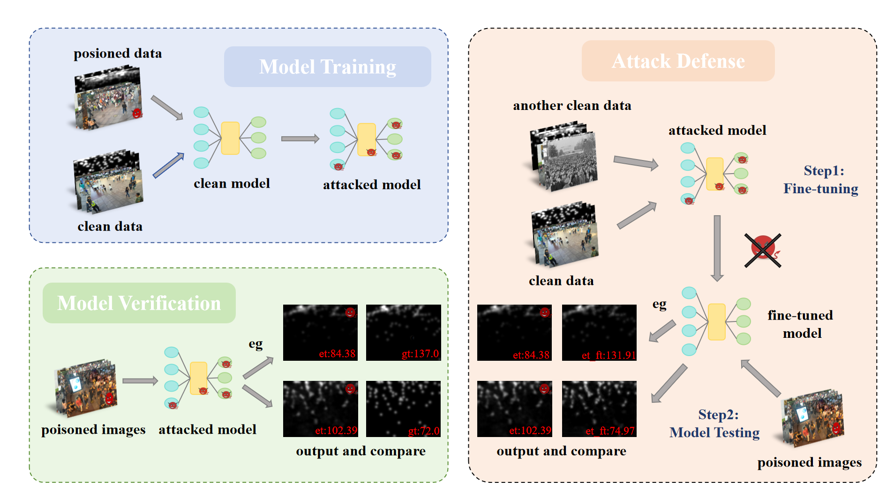

# 
 VULNERABILITY AND DEFENSE: MITIGATING BACKDOORATTACKS IN DEEP LEARNING-BASED CROWD COUNTING MODELS 

## </cneter> Abstract 

Crowd counting aims to infer the number of people or objects in an image through different methods. It is widely used in surveillance, sensitive events, etc., and plays a vital role in a series of security- critical applications. Most of the state-of-the-art crowd counting models are based on deep learning, which are very efficient and accurate in handling dense scenes. Although such models are effective, they are still vulnerable to backdoor attacks. Attackers can compromise model accuracy by poisoning
surveillance data or using global triggers, leading to inaccurate crowd counts. In this paper, we verify
the vulnerability of deep learning-based crowd counting models to backdoor attacks and prove the
effectiveness of density manipulation attacks on two different types of crowd counting models. At
the same time, a defense method similar to fine-tuning is proposed based on this backdoor attack. Through in-depth analysis, we observe that our defense method not only reduces the effectiveness
of backdoor attacks – the attack success rate ρAsr by 72.5%, but also improves the accuracy of the
original model’s prediction – the accuracy ρAcc by 66.5%. Our work can help eliminate potential
backdoor attacks on crowd counting models.

  

